# Sonar Controller Computer for Oregon State Ice Ocean 881a

The 881a sonar controller for the Oregon State Ice Ocean group is a pressure vessel with self-contained battery power and a control computer with a communication port appropriate to talk to the Imagenex 881a sonar.

This document focuses on the unboxing and setup of the control computer.  Issues of pressure vessel selection, mounting, battery power, etc, are left for other documents.

## Components
The sonar control computer hardware consists of:
- [LattePanda 3 Delta 864 single-board computer from DFRobot](https://www.dfrobot.com/product-2594.html)
- [Internal NVMe M.2 Solid State Drive](https://www.amazon.com/SAMSUNG-MZ-V8V1T0B-AM-980-SSD/dp/B08V83JZH4/ref=pd_bxgy_sccl_2/144-3017543-9017269?pd_rd_w=GIsuo&content-id=amzn1.sym.26a5c67f-1a30-486b-bb90-b523ad38d5a0&pf_rd_p=26a5c67f-1a30-486b-bb90-b523ad38d5a0&pf_rd_r=TD57VEE79ATEZT5K2TG4&pd_rd_wg=sJWmn&pd_rd_r=be5d29be-289f-4fb4-9e2a-5a53336e8cf6&pd_rd_i=B08V83JZH4&psc=1)
- [RS485 Connector Expansion shield from DFRobot](https://www.dfrobot.com/product-2284.html)
- [24V buck converter creating 5V at 3A, USB-C](https://www.amazon.com/dp/B09DGDQ48H/ref=redir_mobile_desktop?_encoding=UTF8&aaxitk=a6ebd3502d6291ebe373694ac2c98fb9&content-id=amzn1.sym.cd95889f-432f-43a7-8ec8-833616493f4a%3Aamzn1.sym.cd95889f-432f-43a7-8ec8-833616493f4a&hsa_cr_id=8435668110901&pd_rd_plhdr=t&pd_rd_r=0586913f-22ec-403e-a94f-8db5fd31acd8&pd_rd_w=SLzZC&pd_rd_wg=VE76E&qid=1690669002&ref_=sbx_be_s_sparkle_mcd_asin_0_img&sr=1-1-9e67e56a-6f64-441f-a281-df67fc737124&th=1)

## Unboxing and Assembly

<figure>
  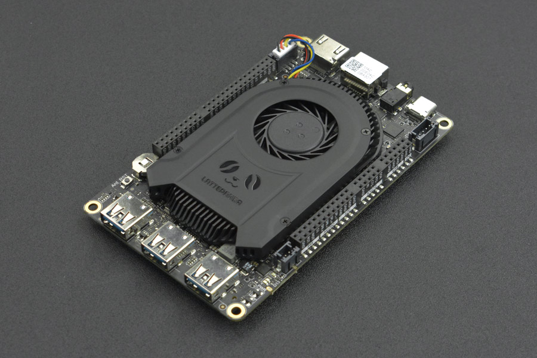
  <figcaption>The LattePanda 3 Delta looks like this out of the box</figcaption>
</figure>

<figure>
  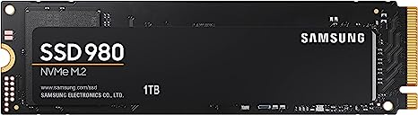
  <figcaption>Samsung 1T NVMe M.2 2280 Solid State Drive</figcaption>
</figure>

<figure>
  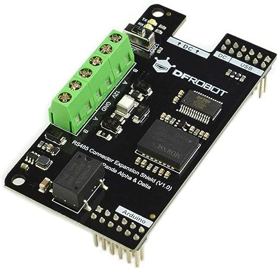
  <figcaption>LattePanda RS-485 expansion shield</figcaption>
</figure>

### Before first power

Install the standoffs that came with the SBC to keep the underside of the board off the benchtop.

<figure>
  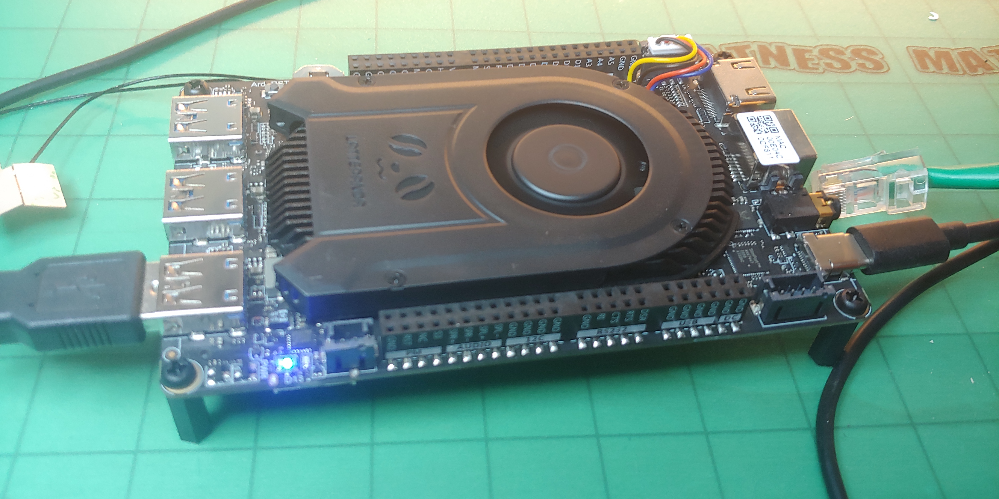
  <figcaption>The LattePanda 3 Delta with standoffs installed</figcaption>
</figure>

Install both Wifi and Bluetooth antennas to the micro connectors on the bottom of the board.  (Try to keep the swearing to a minumum!)

<figure>
  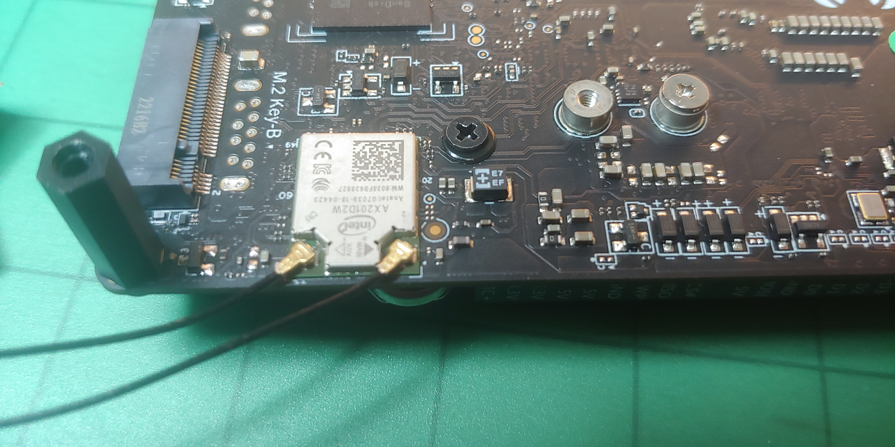
  <figcaption>The LattePanda 3 Delta with wireless antennas installed</figcaption>
</figure>

Install the NVMe M.2 Solid State Disk to the M.2 E-key connection on the bottom of the board.

<figure>
  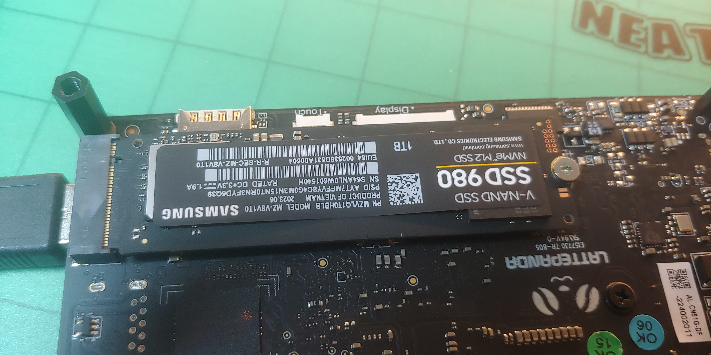
  <figcaption>The LattePanda 3 Delta with NVMe M.2 SSD installed</figcaption>
</figure>

Connect an HDMI monitor, wired Ethernet connection, and USB keyboard and mouse.  The installation will require an internet connection provided over wired Ethernet.

### Power up

Connect the power supply that came with the SBC to the wall and the USB C connector.  This is for setup and development only.  When deployed, the USB C connector will be powered with a buck converter running off battery power.

Depress the power button (tiny stud near the HDMI connector) momentarily.

Observe the LEDs near the USB end of the SBC blink occasionally during boot.

The LattePanda logo should come on the monitor for a few seconds.

The SBC should boot to Windows 10 Professional

### Enable Boot on Power Up

If Windows is running, reboot.  If not, power-up the SBC, remembering to press the power button to start booting.

During the boot process, press the Delete to enter the BIOS.

On the Advanced tab, scroll down to Power management, and press Enter.  Find Boot on AC, and turn it on.

Finish booting, then shut down.  Test by removing USB power from the SBC, then re-attaching the USB power connector.  You should boot directly into Windows.

### Install Linux from USB drive

Obtain the ISO image for the Linux distro.  I used Ubuntu 22.04 LTS Server from August 3, 2023.  I have burned the ISO to a USB drive which should be included.

If you do not have my USB drive, or wish to use a different or newer Linux distro, download and use Balena Etcher or some other tool to burn the image.  
-  Note that simply copying the ISO file to a pre-formatted thumb drive will not work. 
-  The USB drive needs to have at least a capacity equal to the size of the ISO image.
-  Burning the image completely erases all other information on the drive.
-  Ubuntu comes with a tool called ‘Startup Disk Creator’ that works like Balena Etcher for this purpose, if you are creating the installation USB drive on an existing Ubuntu system.

Using either my USB drive or your newly-created one, insert the USB drive into one of the USB slots on the LattePanda 3 Delta SBC.  If windows is running, you may see a popup that says you need to format the drive in order to use it. ***don’t***.  Just dismiss the dialog.

Reboot the SBC.  While rebooting, press Delete to enter the BIOS.  On the Boot tab:
- Change the boot type from UEFI to Legacy
- Change the boot order so that first boot is from the USB drive.  Exit the BIOS to boot from the USB drive.
  - NOTE that you will need an Ethernet cable connected, with Internet access.

Booting from USB may be slower than other methods, so be patient.  You should see a long list of notes as Linux talks to itself during the boot process.

Most of the first configuration questions about keyboard and such are obvious, just press Enter to accept them.  However, I had an issue when I got to a page requesting a network adapter to use during installation.  Apparently, my DHCP was not acceptable to the boot program, and it kept resetting the network adapter, showing an IP address, then rapidly resetting to ‘Disabled’.  Rinse, repeat.  I found that I could use the arrow keys to put the cursor on the adapter, and get a side menu, allowing me to configure the network by hand.  For my network, I used an unused IP address: 
-  Net mask -> 192.168.1.0/24  
-  IP address -> 192.168.1.57  
-  Gateway -> 192.168.1.1  
-  DNS servers -> 1.1.1.1,8.8.8.8  
-  Search URL -> google.com
  - Note that for your network, none of the above manual configuration may be necessary, if the network adapter acquires an IP address reliably.  Also, the example Net mask, IP address, and Gateway above were appropriate for my network, but may not be for yours.  If unsure, you may be able to check with a Windows, Mac, or Linux computer that is properly working on your network.  Use the settings from that, but change the IP address to an unused one.

The installer then used the network connection to download some stuff.

The installer found the LattePanda built-in EMMC storage, but the M.2 drive was not mounted.  So, it offered to install Linux on the whole drive where Windows is currently installed (overwriting Windows).  Which is what I wanted.  I just pressed Enter to allow this.

At this point, you will be presented with a screen asking for your name, the server name, a username, and password (confirmed).  Here is what I suggest using:
-  Your name: &lt;your name&gt;
-  Your server’s name: 881controller&lt;N&gt;  where &lt;N&gt; is 1,2,3, etc, making unique names.
-  Username: sonar881
-  Password: 881

On the next screen, don’t upgrade to Ubuntu Pro.

On the screen asking about SSH, enable SSH, but do not import any keys.

On the screen offering different server environments, choose Docker.

When installation is done, select Done.  It may fail to eject a CD, then ask you to remove your USB drive and press Enter.  Do that.

Reboot the SBC.  While rebooting, press Delete to enter the BIOS.  On the Boot tab:
- Change the boot type back to UEFI from Legacy
- Change the boot order so that first boot is from the Hard drive, which in UEFI mode should show that it boots to Linux.  Exit the BIOS to boot from the internal EMMC SSD.

The SBC should reboot into Linux.  

### Format the NVMe SSD storage and make a filesystem

Fresh out of the box, the M.2 NVMe drive will be initialized, with no partitions.  Our first job is to create a partition.  If you are re-using an M.2 drive for some reason, this step may already be done.

Make the partition on the M.2 NVMe drive. 

Execute:
`lsblk`

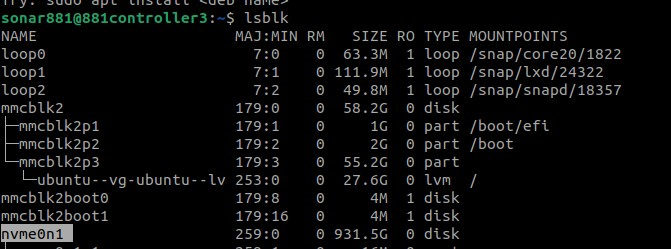

Most likely, your NVMe drive will show up like mine: `/dev/nvme0n1`

To make the partition, execute (using the drive path found from lsblk):

`sudo fdisk /dev/nvme0n1`
- Choose `n` to create a new partition.
- At the prompt, choose `p` for a primary partition.
- Select `1`.
- Other questions will follow, just use defaults.
- When back at the main command, choose `w` to write the data to the disk.

Add a filesystem to the partition.  I am choosing `ntfs` since it will provide portability to directly read and write to the SSD if it is removed from this SBC and put into a Windows computer.  Other formats might be preferrable in a strictly-linux environment.

Use lsblk again to see the name of the partition you just created.  It is probably named `/dev/nvme0n1p1`.  Make the filesystem with this command.

`sudo mkfs -t ntfs /dev/nvme0n1p1`

### Permanently mount the NVMe M.2 SSD

- Log in as `sonar881` (password `881`).
- Create a mount point.  This will be used in `fstab` below, and will be where you see the data for this drive:

`sudo mkdir /mnt/m2`

- At the command prompt, enter:

`sudo blkid`

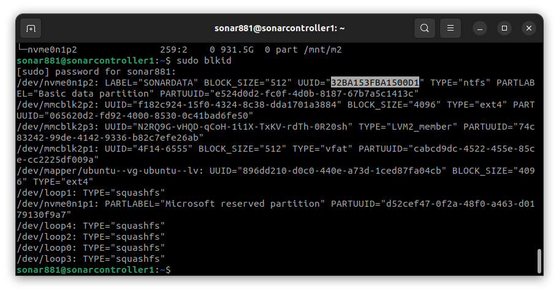

- Look for the partition you created above, probably `/dev/nvme0n1p1` or `/dev/nvme0n1p2`.  Somewhere in the line for this partition, should be `UUID=”32BA153FBA1500D1”`.  Your UUID will of course be different, but will be some long string of Hex digits.  Highlight the UUID (less quotation marks) and copy.

- Now, edit `/etc/fstab`.  To do this, enter:

`cd /etc`

`sudo nano fstab`

At the bottom, enter a line like

`UUID=32BA153FBA1500D1 /mnt/m2       ntfs-3g   auto,users,uid=1000,gid=1000,dmask=027,fmask=137,utf8  0  0`

- Note that the string of hex digits following ‘UUID=’ must be the UUID you captured from the blkid command above.
- Exit the editor, saving the file, and test it with

`sudo mount -a`

- Issuing a new lsblk command should show the mount point `/mnt/m2` for the partition you mounted, and you should see a file or two at `/mnt/m2`.

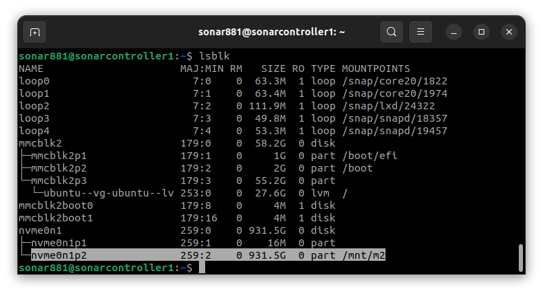

-Try creating a subfolder and writing a file.

### Enable Wifi hotspot

- Log in as `sonar881` (password `881`).
- At the command prompt, enter:

`sudo apt install network-manager`

`[sudo] password for sonar881: 881`

- After installation is complete, enter

`nmcli d`

- You should receive several lines, one of which will indicate that `wlo1`, type `wifi`, is disconnected.  The point of this line is to confirm the name of the wifi network connection (`wlo1` in the example above).  If yours is different, remember to insert it into the commands below).

- Enable the wifi hotspot with

`sudo nmcli d wifi hotspot ifname wlo1 ssid Sonar881 password Sonar881`

- Re-entering `nmcli d` command should now show the wifi hotspot connected:

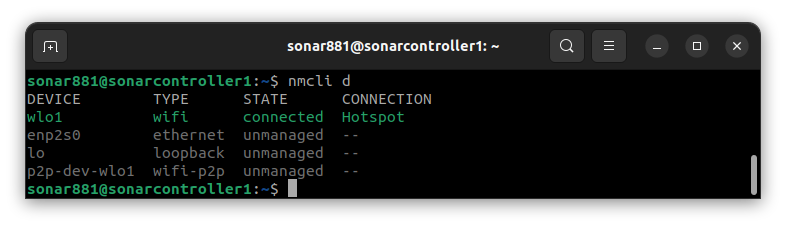

- The above procedure is a proof of concept, not a permanent solution, because it requires you to enable the wifi hotspot manually after every boot.  To enable the wifi hotspot automatically on every boot, we will create a cron job that runs on startup.  The cron job will run a shell script, so we need to provide that as well.

- Let's add the shell script first.  This git repository contains three files in the bootfiles/ directory called start-hotspot1.sh, start-hotspot2.sh, and start-hotspot3.sh.  The three files provide unique SSIDs (Sonar1, Sonar2, and Sonar3) for up to three different controllers.  It should be straightforward to extend the pattern for more.  Copy one of these files onto the SBC, changing its name to omit the final digit of the filename.  One way, would be:

`cd bootfiles`

`scp start-hotspot1.sh sonar881@sonarcontroller1:/home/sonar881/start-hotspot.sh`

- Log into the SBC and install in the correct directory:

`sudo cp start-hotspot.sh /usr/local/bin`

`chmod 744 /usr/local/bin/start-hotspot.sh`

- Now, let's create the cron job to run the script as admin (don't forget the `sudo` here):

`sudo crontab -e`

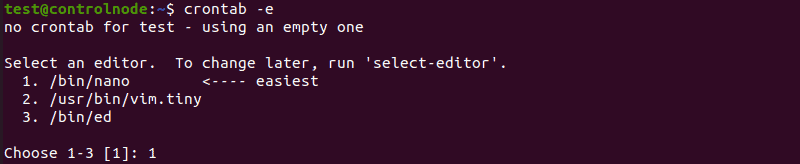

- crontab is a utility for editing the cron job table.  It uses whatever editors are available on the system.  You should probably select nano, since it is the most intuitive.

- When nano starts with the cron job table, use the arrow keys to scroll to the bottom and enter:

`@reboot /usr/local/bin/start-hotspot.sh`

- Use ctrl-X to exit nano, indicating that you want to save.  
- You should now be able to reboot, and confirm, both with `nmcli d` and by browsing available wifi hotspots with your phone or laptop to find `Sonar881`.

### Install Docker

SSH or Log in to the controller and enter:

`sudo apt install docker.io`

Then add the user `sonar881` to the `docker` group:

`sudo gpasswd -a sonar881 docker`

And provide the sudo password `881` if required.

Also, install docker Compose:

`mkdir -p ~/.docker/cli-plugins/`

`curl -SL https://github.com/docker/compose/releases/download/v2.20.2/docker-compose-linux-x86_64 -o ~/.docker/cli-plugins/docker-compose`

`chmod +x ~/.docker/cli-plugins/docker-compose`

To verify that the installation was successful, you can run:

`docker compose version`

Confirm the output:

`Docker Compose version v2.20.2`