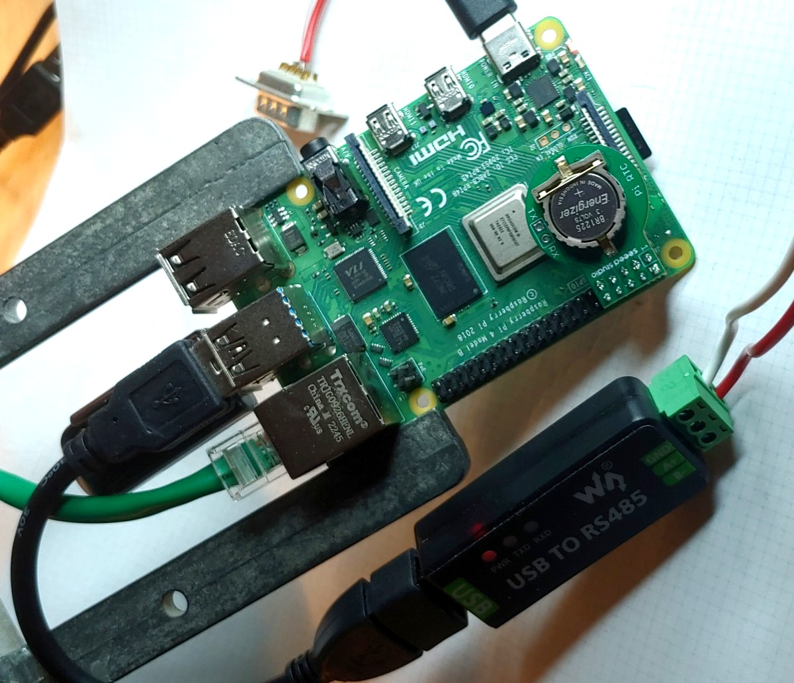
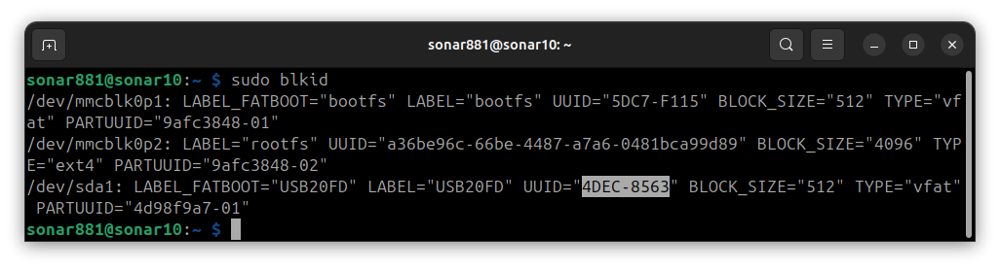
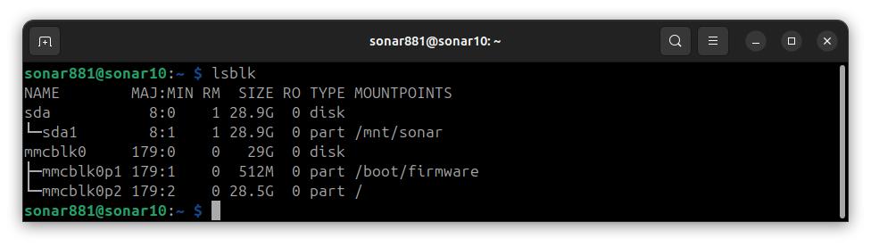
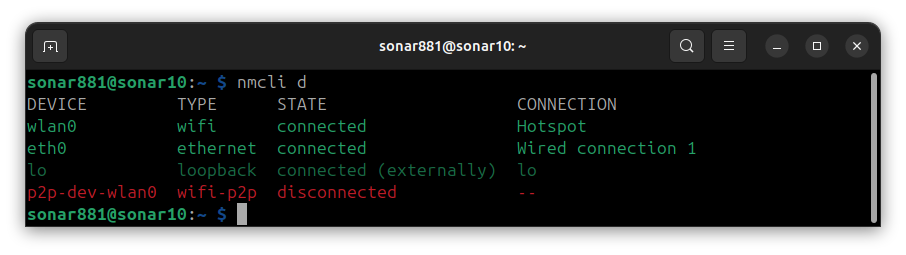
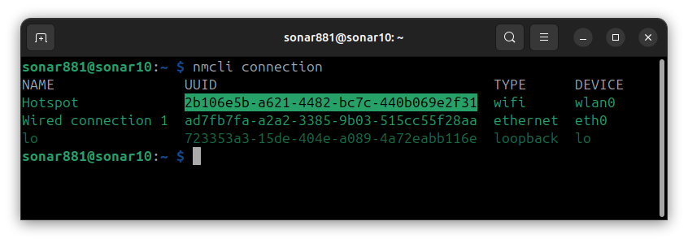
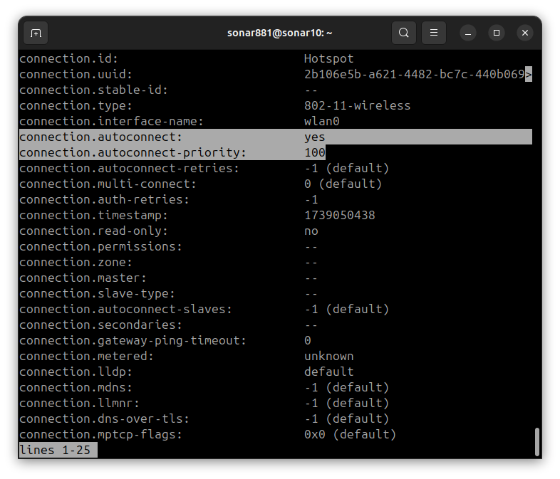
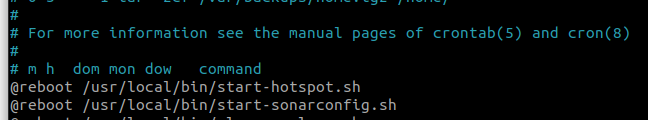
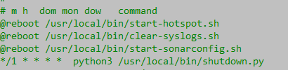

# Sonar Controller Computer for Oregon State University Ice Ocean 881a

The 881a sonar controller for the Oregon State University Ice Ocean group is a pressure vessel with self-contained battery power and a control computer with a communication port appropriate to talk to the Imagenex 881a sonar.

This document focuses on the unboxing and setup of the control computer.  Issues of pressure vessel selection, mounting, battery power, etc, are left for other documents.

## Components
***TODO - Add Seeed RTC module when it comes***

The sonar control computer hardware consists of:
- [Raspberry Pi 4B single-board computer](https://www.raspberrypi.com/products/raspberry-pi-4-model-b/)
- [Generic USB 3.0 thumb drive](https://www.amazon.com/gp/aw/d/B083ZLJ5MG/)
- [Waveshare USB-to-RS485 converter](https://www.amazon.com/gp/aw/d/B081NBCJRS/)


## Unboxing and Assembly

<figure>
  
  <figcaption>The Raspberry Pi 4B with USB thumb drive and RS-485 adapter</figcaption>
</figure>

The Raspberry Pi single-board computer is shown with components installed for use as an Imagenex 881a sonar controller.  Note that it is connected to the Internet with a hard-wired Ethernet connection for development.  The Ethernet wire will be removed for deployment. Since Wifi network will be turned into a Wifi hot spot, Wifi is not available on this board as a route to the Internet.

- Power is being provided via USB-C on the lower right of the board.
- The board is booting and running its O/S and programs from the micro-SD card, the edge of which can be seen peeking out of the bottom edge of the board.
- The Ethernet wire used for development can be seen at the top left of the board.
- The RS-485 converter is connected to a USB slot via a short extension cord, since it is too wide to plug directly in.
- The USB thumb drive is marginally visible in the USB slot under the extension cord.

Note the best performance will be achieved using the two USB slots next to the Ethernet jack, since these are USB 3, which are higher speed than the two at the other corner of the board, which are USB 2.  These two USB 2 slots are perfect for a keyboard and mouse during development.

Also, the board supports two monitors over HDMI, on the right edge of the board.  Unfortunately, these are micro HDMI connectors, so required a special HDMI cable or converter.

For general setup of the Raspberry Pi board, see [this tutorial](https://www.raspberrypi.com/documentation/computers/getting-started.html).

### Setup

Use the Raspberry Pi OS (64-bit) to flash to the microSD card.

Connect an HDMI monitor, wired Ethernet connection, and USB keyboard and mouse.  The installation will require an internet connection provided over wired Ethernet.

### Power up

During first boot, ensure that the Raspberry Pi has an Ethernet cable plugged in that provides access to the Internet.

Follow the instructions for first boot, and when prompted:
- Make a note of the Raspberry Pi's IP address
- Create the first user 'admin' with password 'admin'.
- Skip connecting to a Wifi network.
- Select Chromium as the default browser.
- Let the software update itself if needed.

After the software updates and reboots (reboot manually if needed), use the GUI to launch a console and type
`sudo raspi-config`

In raspi-config, use the keyboard arrow keys and <enter> key to:
- System Settings -> Hostname  set to 'SonarXX' where 'XX' is the 2-digit id number of the sonar controller.  For example, 'sonar10'.
- Interfaces -> SSH  enable SSH access
- Interfaces -> I2C  enable the Arm I2C interface

Exit raspi-config, and allow it to reboot.

The following instructions will be done by keyboard commands at the command line interface.  You can either use the GUI and launch a terminal to work in or remote in from another computer using SSH.

### Create the sonar881 user

All processing of the Sonar 881 will be done with this user's credentials.  The source code and data files will be owned by it.

Create the user:
`admin@sonar10:~ $ sudo adduser sonar881`

Make the password `881`.

Also, add the sonar881 user to some groups.  This will allow it to use devices like the serial ports and I2C, as well as give it access to sudo.

`admin@sonar10:~ $ sudo usermod -a -G adm,dialout,cdrom,sudo,audio,video,plugdev,games,users,netdev,input,spi,i2c,gpio sonar881`


### Permanently mount the USB thumb drive

- Log in as `sonar881` (password `881`).
- Create a mount point.  This will be used in `fstab` below, and will be where you see the data for this drive:

`sudo mkdir /mnt/data`

- At the command prompt, enter:

`sudo blkid`



- Look for the partition you created above, probably `/dev/sda1` or `/dev/sdb1`.  Somewhere in the line for this partition, should be `UUID=”4DEC-8563”`.  Your UUID will of course be different, but will be some long string of Hex digits.  Highlight the UUID (less quotation marks) and copy.

- Capture the UID and GID of the sonar881 user with the command:

`id`

Since the `admin` user was created at installation, and the `sonar881` user was second, it is likely that both UID and GID of `sonar881` will be 1001.

- Now, edit `/etc/fstab`.  To do this, enter:

`cd /etc`

`sudo nano fstab`

At the bottom, enter a line like

`UUID=4DEC-8563 /mnt/data       vfat   auto,users,uid=1001,gid=1001,dmask=027,fmask=137,utf8  0  0`

- Note that the string of hex digits following ‘UUID=’ must be the UUID you captured from the blkid command above.
- Use the uid and gid you captured above.
- Exit the editor, saving the file, and test it with

`sudo mount -a`

- Issuing a new lsblk command should show the mount point `/mnt/data` for the partition you mounted, and you should see a file or two at `/mnt/data`.



-Try creating a subfolder and writing a file.

### Enable Wifi hotspot

This section summarizes a longer tutorial at [raspberrypi.com](https://www.raspberrypi.com/tutorials/host-a-hotel-wifi-hotspot/). For more detail, read the section `Create hotspot network`.


- Log in as `sonar881` (password `881`).
- At the command prompt, enter:

`nmcli d`

- You should receive several lines, one of which will indicate that `wlan0`, type `wifi`, is disconnected.  The point of this line is to confirm the name of the wifi network connection (`wlan0` in the example above).  If yours is different, remember to insert it into the commands below.

- Enable the wifi hotspot with

`sudo nmcli device wifi hotspot ssid Sonar10 password Sonar881 ifname wlan0`

- Re-entering `nmcli d` command should now show the wifi hotspot connected:



You should also see a hotspot called Sonar881 visible to your laptop, phone, or tablet.  Don't connect to it yet; we are not done.

Our next step is to make the wifi hotspot available immediately after every reboot.  To do this, we need to change two settings for the hotspot connection from their defaults: `autoconnect` and `autoconnect-priority`.

First, we will identify our network connection's UUID.  We will use this long string of hex characters to identify the connection to modify.

Enter:

`nmcli connection`



The highlighted UUID belongs to the `wlan0` connection for this particular raspberry pi.  Your UUID will be different, so be sure to do this step and copy the UUID somewhere.

Now, using the UUID, we enter (again, be sure to replace the UUID shown with your own):

`sudo nmcli connection modify 2b106e5b-a621-4482-bc7c-440b069e2f31 connection.autoconnect yes connection.autoconnect-priority 100`

After modifying these two settings for the `wlan0` connection, we confirm it using:

`nmcli connection show 2b106e5b-a621-4482-bc7c-440b069e2f31`



Note that the command above resuls in a *very* long list of parameters, and only the area surrounding the two of interest are shown.  You may need to search around a bit to find these two lines.


### Download the Sonar881 code
Note that files needed for several steps come from the git repository, which can be obtained online from github.  To set this up, create a directory for repositories called coastalboundary:

`mkdir ~/coastalboundary`

Now, change into the `coastalboundary` directory and clone the repository

`cd ~/coastalboundary`

`git clone https://github.com/coastalboundarydynamicsresearchgroup/SonarController.git`

The steps below that reference repository directories are now referenced as if you are starting in `~/coastalboundary/SonarController`.


### Create a configuraton file
In the folder source/configuration are several configuration files, used as templates for your own needs.  The `configuration10.json` file is appropriate for Raspberry Pi deployments, but may need to be modified.

Make a copy of your selected and edited configuration file and call it `configuration.json`.

Also, sonar executable configurations will be placed at `/mnt/sonar/configuration/`.  Make that folder now with:
`mkdir /mnt/sonar/configuration`


### Install the Docker container system
Enter the `bootfiles` directory:

`cd bootfiles`

Execute the shell script to install the official docker GPG key and set up the repostitory:

`bash ./docker-install.sh`

This will take some time.  It will pull the packages from the repository and install them.  It will aslo give the current user access to docker commands, so it is imperative to run this as user `sonar881`.

After a successful install, confirm that the `sonar881` user has docker access with `sudo`:

`docker ps`

If this will not run, there are two things to try:
- Log out of the `sonar881` user and log back in.  Some permissions settings require this to take effect.
- If logging out does not work, look at the `docker-install.sh` script and execute the final two instructions manually.  The first of these two is commented and will create the `docker` group.  The second adds the `sonar881` user to the `docker` group.  Again, you may need to log out and back in to test this.

After gaining access, you can test the docker installation with:

`docker run hello-world`

This wil download the hello-wolrd container and run it.  When it runs, it will print messages from inside the container onto the console.


### Build and run the containers

The docker containers are run in production by the `SonarController/source/compose.yml` file.  This file directs the composition of the underlying services in response the the `docker compose up` command.

However, there is some preparation required to get the docker images ready to run.  The high-level story here is:
- build the initial v1.0 of the service
- run the service with a live console
- if not all dependencies were installed correctly by the build step, fix that by command line
- without exiting the repaired, running container, use another console to commit the v1.1 service
- exit the running console, and confirm the v1.1 service runs correctly

Do the above steps for each service.  The services are listed in the `compose.yml` file in the `source` directory.  Look at the `build:` attribute of each service to find the working directory for that service.

Note the startup command for the `deploy` container is different from the others: `python3 ./deploy`.

1. Go to the working directory of the service.
2. `./dockb`
3. The above command will build the docker container v1.0 for the service.
4. `./dock-start`
5. The above command will run the v1.0 container and provide a console connected to it.
6. Once in the running container, see if all components were installed:
7. `npm start` or appropriate
8. If an error occurs and you are taken back to the prompt, you need to install missing packages:
9. `npm install`
10. Run the app again:
11. `npm start` or appropriate
12. When you have a running service, use another console, logged into the `sonar881` user:
13. `docker ps`
14. This command will show the running container.  Copy its 24-digit hex ID into the clipboard.  Also note the image name, as you will need to type it with the version changed to 1.1:
15. docker commit ***ID*** louisross/***servicename***:1.1
16. Confirm that the new image was committed using:
17. `docker image ls`
18. On the original console, still running the patched v1.0 service, Ctrl-C and `exit`.  Then test the v1.1 service with `./dock`, and start with `npm start` or appropriate.


### Clean logs on boot
The flash drive storage on the SBC is not huge (about 50 GB), and after a few weeks of use, can be completely filled with log files.  These files are normal Linux activity, but not needed for the sonar controller, and will render it useless if allowed to fill up.

To address this problem, we install a script that runs every time the computer boots that will delete all log files.

`cd bootfiles`

`scp clear-syslogs.sh sonar881@sonarcontroller1:/home/sonar881/clear-syslogs.sh`

- Log into the SBC and install in the correct directory:

`sudo cp clear-syslogs.sh /usr/local/bin`

`chmod 744 /usr/local/bin/clear-syslogs.sh`

- Now, let's create the cron job to run the script as admin (don't forget the `sudo` here):

`sudo crontab -e`

- When nano starts with the cron job table, use the arrow keys to scroll to the bottom and enter:

`@reboot /usr/local/bin/clear-syslogs.sh`

- Use ctrl-X to exit nano, indicating that you want to save.  

The `sudo` version of crontab should now look like this:




### Start Docker Containers on Boot

Note that I had the Perplexity AI write these instructions.  They seem to work, so here they are:
- Enable the Docker system service to start on boot:
`sudo systemctl enable docker`

- Create a systemd service file to run the Docker Compose setup:

`sudo nano /etc/systemd/system/docker-compose-sonar.service`

- Paste the following into the editor and save:
```
[Unit]
Description=Docker Compose Sonar881 Service
Requires=docker.service
After=docker.service

[Service]
Type=oneshot
RemainAfterExit=yes
WorkingDirectory=/home/sonar881/coastalboundary/SonarController/source
ExecStart=/usr/bin/docker compose up -d
ExecStop=/usr/bin/docker compose down

[Install]
WantedBy=multi-user.target
```

If for some reason your git repository is not in `/home/sonar881/coastalboundary/SonarController`, be sure to supply the correct path. 

Finally, enable and start the service.

`sudo systemctl enable docker-compose-sonar.service`

`sudo systemctl start docker-compose-sonar.service`


### Check for Periodic Shutdown

To shut down the computer on command, we install a script that runs periodically.  The script will check for the existence of a shutdown file and execute the system shutdown if it exists.  All any program needs to do to shut down the computer is to copy a file with the correct name to this location.

Assuming the git repository is cloned on the Sonar controller, follow these steps.

`cd bootfiles`

`sudo cp shutdown.py /usr/local/bin`

`chmod 744 /usr/local/bin/shutdown.py`

- Now, let's create the cron job to run the script as admin (don't forget the `sudo` here):

`sudo crontab -e`

- When nano starts with the cron job table, use the arrow keys to scroll to the bottom and enter:

`*/1 * * * *  python3 /usr/local/bin/shutdown.py`

- Use ctrl-X to exit nano, indicating that you want to save.  

The `sudo` version of crontab should now look like this:


