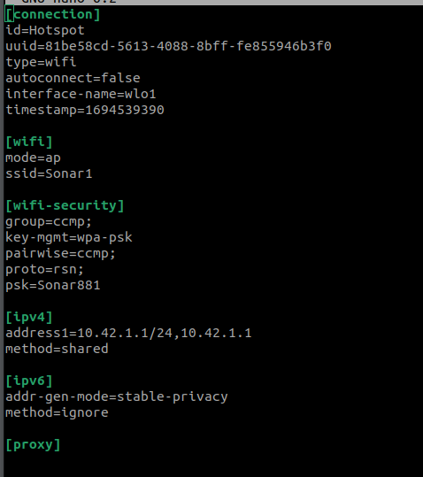
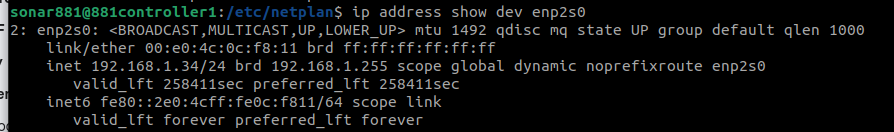
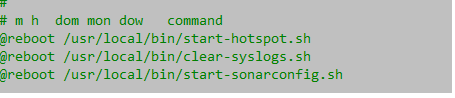

# Sonar Controller Computer for Oregon State University Ice Ocean 881a

The 881a sonar controller for the Oregon State Ice Ocean group is a pressure vessel with self-contained battery power and a control computer with a communication port appropriate to talk to the Imagenex 881a sonar.

This document focuses on the unboxing and setup of the control computer.  Issues of pressure vessel selection, mounting, battery power, etc, are left for other documents.

## Components
The sonar control computer hardware consists of:
- [Raspberry Pi 4B single-board computer](https://www.raspberrypi.com/products/raspberry-pi-4-model-b/)
- [Generic USB 3.0 thumb drive](https://www.amazon.com/gp/aw/d/B083ZLJ5MG/)
- [Waveshare USB-to-RS485 converter](https://www.amazon.com/gp/aw/d/B081NBCJRS/)

## Unboxing and Assembly

<figure>
  
  <figcaption>The Raspberry Pi 4B with USB thumb drive and RS-485 adapter</figcaption>
</figure>

The Raspberry Pi single-board computer is shown with components installed for use as an Imagenex 881a sonar controller.  Note that it is connected to the Internet with a hard-wired Ethernet connection for development.  The Ethernet wire will be removed for deployment. Since Wifi network will be turned into a Wifi hot spot, Wifi is not available on this board as a route to the Internet.

- Power is being provided via USB-C on the lower right of the board.
- The board is booting and running its O/S and programs from the micro-SD card, the edge of which can be seen peeking out of the bottom edge of the board.
- The Ethernet wire used for development is can be seen at the top left of the board.
- The RS-485 converter is connected to a USB slot via a short extension cord, since it is too wide to plug directly in.
- The USB thumb drive is marginally visible in the USB slot under the extension cord.

Note the best performance will be achieved using the two USB slots next to the Ethernet jack, since these are USB 3, which are higher speed than the two at the other corner of the board, which are USB 2.  These two USB 2 slots are perfect for a keyboard and mouse during development.

Also, the board supports two monitors over HDMI, on the right edge of the board.  Unfortunately, these are micro HDMI connectors, so required a special HDMI cable or converter.

For general setup of the Raspberry Pi board, see [this tutorial](https://www.raspberrypi.com/documentation/computers/getting-started.html).

### Setup

Use the Raspberry Pi OS (64-bit) to flash to the microSD card.

Connect an HDMI monitor, wired Ethernet connection, and USB keyboard and mouse.  The installation will require an internet connection provided over wired Ethernet.

### Power up

During first boot, ensure that the Raspberry Pi has an Ethernet cable plugged in that provides access to the Internet.

Follow the instructions for first boot, and when prompted:
- Make a note of the Raspberry Pi's IP address
- Create the first user 'admin' with password 'admin'.
- Skip connecting to a Wifi network.
- Select Chromium as the default browser.
- Let the software update itself if needed.

After the software updates and reboots (reboot manually if needed), use the GUI to launch a console and type
`sudo raspi-config`

In raspi-config, use the keyboard arrow keys and <enter> key to:
- System Settings -> Hostname  set to 'SonarXX' where 'XX' is the 2-digit id number of the sonary controller.  For example, 'sonar10'.
- Interfaces -> SSH  enable SSH access
- Interfaces -> I2C  enable the Arm I2C interface

Exit raspi-config, and allow it to reboot.

The following instructions will be done by keyboard commands at the command line interface.  You can either use the GUI and launch a terminal to work in or remote in from another computer using SSH.

### Create the sonar881 user

All processing of the Sonar 881 will be done with this user's credentials.  The source code and data files will be owned by it.

Create the user:
`admin@sonar10:~ $ sudo adduser sonar881`

Make the password `881`.

Also, add the sonar881 user to some groups.  This will allow it to use devices like the serial ports and I2C, as well as give it access to sudo.

`admin@sonar10:~ $ sudo usermod -a -G adm,dialout,cdrom,sudo,audio,video,plugdev,games,users,netdev,input,spi,i2c,gpio sonar881`

### Install Packages

### Permanently mount the NVMe M.2 SSD

- Log in as `sonar881` (password `881`).
- Create a mount point.  This will be used in `fstab` below, and will be where you see the data for this drive:

`sudo mkdir /mnt/m2`

- At the command prompt, enter:

`sudo blkid`

- Look for the partition you created above, probably `/dev/nvme0n1p1` or `/dev/nvme0n1p2`.  Somewhere in the line for this partition, should be `UUID=”32BA153FBA1500D1”`.  Your UUID will of course be different, but will be some long string of Hex digits.  Highlight the UUID (less quotation marks) and copy.

- Now, edit `/etc/fstab`.  To do this, enter:

`cd /etc`

`sudo nano fstab`

At the bottom, enter a line like

`UUID=32BA153FBA1500D1 /mnt/m2       ntfs-3g   auto,users,uid=1000,gid=1000,dmask=027,fmask=137,utf8  0  0`

- Note that the string of hex digits following ‘UUID=’ must be the UUID you captured from the blkid command above.
- Exit the editor, saving the file, and test it with

`sudo mount -a`

- Issuing a new lsblk command should show the mount point `/mnt/m2` for the partition you mounted, and you should see a file or two at `/mnt/m2`.

-Try creating a subfolder and writing a file.

### Enable Wifi hotspot

- Log in as `sonar881` (password `881`).
- At the command prompt, enter:

`sudo apt install network-manager`

`[sudo] password for sonar881: 881`

- After installation is complete, enter

`nmcli d`

- You should receive several lines, one of which will indicate that `wlo1`, type `wifi`, is disconnected.  The point of this line is to confirm the name of the wifi network connection (`wlo1` in the example above).  If yours is different, remember to insert it into the commands below).

- Enable the wifi hotspot with

`sudo nmcli d wifi hotspot ifname wlo1 ssid Sonar1 password Sonar881`

- Re-entering `nmcli d` command should now show the wifi hotspot connected:

You should also see a hotspot called Sonar881 visible to your laptop, phone, or tablet.  Don't connect to it yet; we are not done.

Log into the SBC and change to the network-manager directory that controls the hotspot:

`cd /etc/NetworkManager/system-connections`

`ls -al`

When you instructed network-manager to create a hotspot above, it wrote a file in this directory called `Hotspot.nmconnection`.  Edit this file:

`sudo nano Hotspot.nmconnection`

Edit or create the `[ipv4]` section as needed so it looks like this:

The third digit in the IP addresses on the `address1` line should be unique for each controller SBC.  This will allow you to run more than one in the same local area without conflict.  Example: `10.42.1.1, 10.42.2.1, 10.42.3.1`, etc.

To make the above change take effect, restart the network-manager service:

`sudo service NetworkManager restart`

and then re-issue the manual hotspot command:

`sudo nmcli d wifi hotspot ifname wlo1 ssid Sonar1 password Sonar881`

The above procedure is a proof of concept, not a permanent solution, because it requires you to enable the wifi hotspot manually after every boot.  To enable the wifi hotspot automatically on every boot, we will create a cron job that runs on startup.  The cron job will run a shell script, so we need to provide that as well.

- Note that the script files required for several steps come from the git repository, which can be obtained online from github.  To set this up, create a directory for repositories called github:

    `mkdir ~/github`

    Now, change into the `github` directory and clone the repository

    `cd ~/github`

    `git clone https://github.com/LouisRoss/SonarController.git`

    The steps below that reference repository directories are now referenced as if you are starting in `~/github/SonarController`.

- Let's add the shell script first.  This git repository contains three files in the bootfiles/ directory called start-hotspot1.sh, start-hotspot2.sh, and start-hotspot3.sh.  The three files provide unique SSIDs (Sonar1, Sonar2, and Sonar3) for up to three different controllers.  It should be straightforward to extend the pattern for more.  Copy one of these files onto the SBC, changing its name to omit the final digit of the filename.  One way, would be:

`cd bootfiles`

`sudo cp start-hotspot1.sh /usr/local/bin/start-hotspot.sh`

`chmod 744 /usr/local/bin/start-hotspot.sh`

- Now, let's create the cron job to run the script as admin (don't forget the `sudo` here):

`sudo crontab -e`

- crontab is a utility for editing the cron job table.  It uses whatever editors are available on the system.  You should probably select nano, since it is the most intuitive.

- When nano starts with the cron job table, use the arrow keys to scroll to the bottom and enter:

`@reboot /usr/local/bin/start-hotspot.sh`

- Use ctrl-X to exit nano, indicating that you want to save.  
- You should now be able to reboot, and confirm, both with `nmcli d` and by browsing available wifi hotspots with your phone or laptop to find `Sonar881`.

### Set Ethernet to Automatically Obtain an IP Address

During installation, it may have been necessary to set the IP address of the wired Ethernet to a fixed IP address in order to make the installer work.  If that was done, now is the time to reset it back to a more generally useful state.  The problem is that with a fixed IP address, the wired Ethernet may not work when taken to another network, such as in the field.

To change the network configuration, we will replace a file generated by the installer with one in our repository.  We will be working in the `/etc/netplan` directory.  The old file is called `00-installer-config.yaml` and we will replace it with `99-ethernet.yaml`.

First, make a backup.

`cd /etc/netplan`

`sudo mkdir backup` (password is `881` if needed)

`sudo cp * backup`

Now, remove the old file.

`sudo rm 00-installer-config.yaml`

Finally, copy the new file.  Here, we assume the git respository is already cloned to `~/github/SonarController`.  See above for instructions if needed.

`cd ~/github/SonarController/bootfiles`

`sudo cp 99-ethernet.yaml /etc/netplan`

To test this, reboot the board:

`sudo shutdown -r now`

After reboot, log back in and check the status of the wired Ethernet device enp2s0:

`ip address show device enp2s0`

You should get an answer something like this:

The important things that indicate success are that the state should be UP and there should be a line starting with `inet a.b.c.d/x` showing a reasonable IP address.  You should be able to ssh into the computer using this IP address from another computer on the same network, so you may want to copy the IP address down.

### Clean logs on boot
The flash drive storage on the SBC is not huge (about 50 GB), and after a few weeks of use, can be completely filled with log files.  These files are normal Linux activity, but not needed for the sonar controller, and will render it useless if allowed to fill up.

To address this problem, we install a script that runs every time the computer boots that will delete all log files.

`cd bootfiles`

`scp clear-syslogs.sh sonar881@sonarcontroller1:/home/sonar881/clear-syslogs.sh`

- Log into the SBC and install in the correct directory:

`sudo cp clear-syslogs.sh /usr/local/bin`

`chmod 744 /usr/local/bin/clear-syslogs.sh`

- Now, let's create the cron job to run the script as admin (don't forget the `sudo` here):

`sudo crontab -e`

- When nano starts with the cron job table, use the arrow keys to scroll to the bottom and enter:

`@reboot /usr/local/bin/clear-syslogs.sh`

- Use ctrl-X to exit nano, indicating that you want to save.  

The `sudo` version of crontab should now look like this:

### Install Docker

SSH or Log in to the controller and enter:

`sudo apt install docker.io`

Then add the user `sonar881` to the `docker` group:

`sudo gpasswd -a sonar881 docker`

And provide the sudo password `881` if required.

Also, install docker Compose:

`mkdir -p ~/.docker/cli-plugins/`

`curl -SL https://github.com/docker/compose/releases/download/v2.20.2/docker-compose-linux-x86_64 -o ~/.docker/cli-plugins/docker-compose`

`chmod +x ~/.docker/cli-plugins/docker-compose`

To verify that the installation was successful, you can run:

`docker compose version`

Confirm the output:

`Docker Compose version v2.20.2`

### Start Docker Containers on Boot

To start the Docker containers that run the system on boot, we install a script that runs every time the computer boots.  Assuming the git repository is cloned on the Sonar controller, follow these steps.

`cd bootfiles`

`sudo cp start-sonarconfig.sh /usr/local/bin`

`chmod 744 /usr/local/bin/start-sonarconfig.sh`

- Now, let's create the cron job to run the script as admin (don't forget the `sudo` here):

`sudo crontab -e`

- When nano starts with the cron job table, use the arrow keys to scroll to the bottom and enter:

`@reboot /usr/local/bin/start-sonarconfig.sh`

- Use ctrl-X to exit nano, indicating that you want to save.  

The `sudo` version of crontab should now look like this:

### Check for Periodic Shutdown

To shut down the computer on command, we install a script that runs periodically.  The script will check for the existence of a shutdown file and execute the system shutdown if it exists.  All any program needs to do to shut down the computer is to copy a file with the correct name to this location.

Assuming the git repository is cloned on the Sonar controller, follow these steps.

`cd bootfiles`

`sudo cp shutdown.py /usr/local/bin`

`chmod 744 /usr/local/bin/shutdown.py`

- Now, let's create the cron job to run the script as admin (don't forget the `sudo` here):

`sudo crontab -e`

- When nano starts with the cron job table, use the arrow keys to scroll to the bottom and enter:

`*/1 * * * *  python3 /usr/local/bin/shutdown.py`

- Use ctrl-X to exit nano, indicating that you want to save.  

The `sudo` version of crontab should now look like this:

